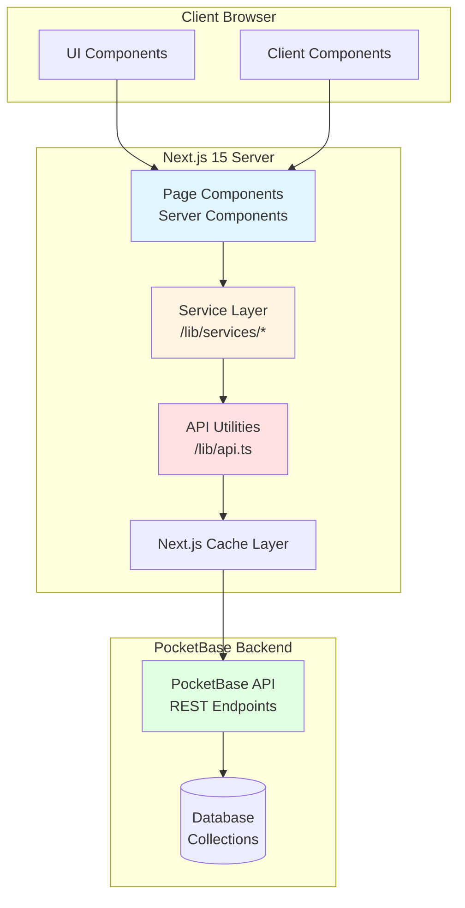
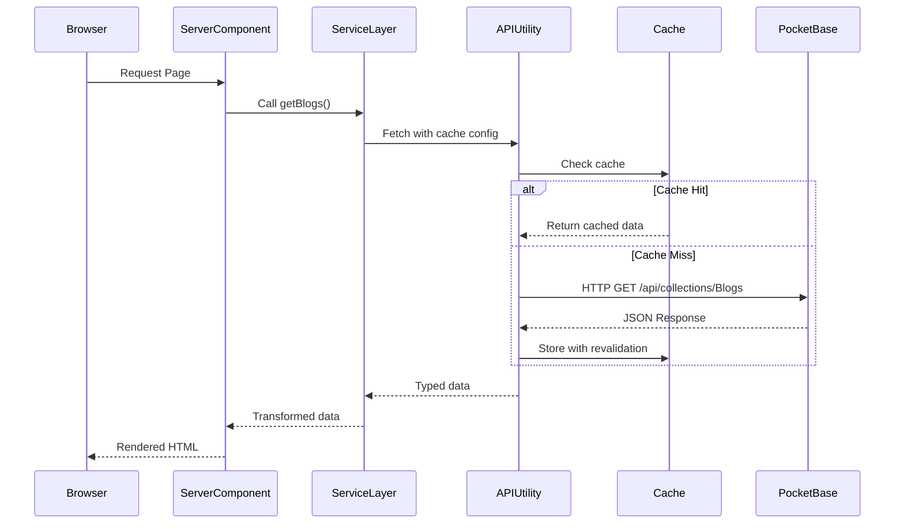

# Design Document

## Overview

This design document outlines the architecture and implementation strategy for integrating PocketBase with a Next.js 15 website. The integration follows clean architecture principles with a clear separation between data fetching, business logic, and UI presentation. The design leverages Next.js 15's Server Components, Server Actions, and advanced caching strategies to deliver optimal performance while maintaining type safety throughout the application.

### Key Design Principles

1. **Separation of Concerns**: Data fetching logic isolated in service layer, UI components remain pure
2. **Type Safety**: Comprehensive TypeScript typing using auto-generated PocketBase types
3. **Performance First**: Strategic caching with appropriate revalidation periods
4. **Server-First**: Maximize Server Components, minimize client-side JavaScript
5. **Progressive Enhancement**: Static generation with dynamic updates where needed
6. **Error Resilience**: Graceful error handling with fallbacks

## Architecture

### High-Level Architecture Diagram



### Data Flow



## Components and Interfaces

### 1. Service Layer Architecture

The service layer provides a clean abstraction over PocketBase API calls. Each collection gets its own service file.

#### Service File Structure

```
/lib/services/
├── blogs.ts          # Blog-related data fetching
├── authors.ts        # Author profiles
├── testimonials.ts   # Customer testimonials
├── pricing.ts        # Pricing plans
├── features.ts       # Product features
├── integrations.ts   # Platform integrations
├── partners.ts       # Company partners
├── careers.ts        # Job positions
├── company.ts        # Leadership, values, milestones, stats
├── contact.ts        # Contact options and enquiries
├── support.ts        # Support resources and FAQs
├── locations.ts      # Office locations
└── press.ts          # Press releases
```

#### Service Function Pattern

Each service file follows this pattern:

```typescript
// lib/services/blogs.ts
import type { BlogsResponse, AuthorsResponse, CategoryResponse } from '@/types/pocketbase';

/**
 * Fetch all published blogs with pagination
 */
export async function getBlogs(options?: {
  page?: number;
  perPage?: number;
  category?: string;
}): Promise<{
  items: BlogsResponse[];
  totalPages: number;
  totalItems: number;
}> {
  // Implementation using lib/api.ts functions
}

/**
 * Fetch a single blog by slug
 */
export async function getBlogBySlug(slug: string): Promise<BlogsResponse | null> {
  // Implementation with error handling
}

/**
 * Fetch featured blogs for homepage
 */
export async function getFeaturedBlogs(limit?: number): Promise<BlogsResponse[]> {
  // Implementation with caching
}
```

### 2. API Utility Layer

The `/lib/api.ts` file (already exists) provides low-level fetch utilities with caching. It will be enhanced to support all collections.

#### Key Functions

```typescript
// Generic collection fetcher
async function fetchCollection<T>(
  collectionName: string,
  options: ListOptions,
  cacheConfig: CacheConfig
): Promise<PocketBaseListResponse<T>>

// Generic record fetcher
async function fetchRecord<T>(
  collectionName: string,
  recordId: string,
  options: RecordOptions,
  cacheConfig: CacheConfig
): Promise<T>

// Cache revalidation helpers
export async function revalidateCache(tags: string[]): Promise<void>
```

### 3. Server Components Pattern

Pages use Server Components to fetch data and render UI:

```typescript
// app/blog/page.tsx
import { getBlogs, getFeaturedBlogs } from '@/lib/services/blogs';
import { BlogList } from '@/components/blog/blog-list';
import { FeaturedBlog } from '@/components/blog/featured-blog';

export default async function BlogPage() {
  // Parallel data fetching
  const [blogs, featuredBlogs] = await Promise.all([
    getBlogs({ perPage: 12 }),
    getFeaturedBlogs(3)
  ]);

  return (
    <main>
      <FeaturedBlog blog={featuredBlogs[0]} />
      <BlogList blogs={blogs.items} />
    </main>
  );
}
```

### 4. Client Components for Interactivity

Client Components handle user interactions:

```typescript
// components/contact/contact-form.tsx
'use client';

import { submitContactForm } from '@/lib/actions/contact';
import { useFormState } from 'react-dom';

export function ContactForm() {
  const [state, formAction] = useFormState(submitContactForm, null);
  
  return (
    <form action={formAction}>
      {/* Form fields */}
    </form>
  );
}
```

### 5. Server Actions for Mutations

Server Actions handle form submissions and data mutations:

```typescript
// lib/actions/contact.ts
'use server';

import { createEnquiry } from '@/lib/services/contact';
import { revalidatePath } from 'next/cache';

export async function submitContactForm(
  prevState: any,
  formData: FormData
) {
  try {
    const data = {
      name: formData.get('name') as string,
      email: formData.get('email') as string,
      message: formData.get('message') as string,
      interest: formData.get('interest') as string,
    };

    // Validate
    if (!data.name || !data.email || !data.message) {
      return { success: false, error: 'All fields are required' };
    }

    // Submit to PocketBase
    await createEnquiry(data);

    // Revalidate if needed
    revalidatePath('/contact');

    return { success: true, message: 'Thank you for contacting us!' };
  } catch (error) {
    return { success: false, error: 'Failed to submit form' };
  }
}
```

## Data Models

### Type System

All data models use auto-generated TypeScript types from `/types/pocketbase.ts`. These types are generated using `pocketbase-typegen` and provide complete type safety.

#### Key Type Patterns

```typescript
// Response types include system fields
type BlogsResponse = {
  id: string;
  collectionId: string;
  collectionName: string;
  created: string;
  updated: string;
  title: string;
  slug: string;
  content: string;
  excerpt: string;
  author: string;  // Relation ID
  category: string;  // Relation ID
  featured_image: string[];
  tags: any;
  featured: boolean;
  published: boolean;
  published_date: string;
  views: number;
  expand?: {
    author?: AuthorsResponse;
    category?: CategoryResponse;
  };
}
```

### Data Transformation Layer

Service functions may transform PocketBase responses for easier consumption:

```typescript
// lib/services/blogs.ts
export interface BlogWithRelations extends BlogsResponse {
  authorData: AuthorsResponse;
  categoryData: CategoryResponse;
  imageUrl: string;
}

export async function getBlogWithRelations(slug: string): Promise<BlogWithRelations> {
  const blog = await getBlogBySlug(slug);
  
  return {
    ...blog,
    authorData: blog.expand?.author!,
    categoryData: blog.expand?.category!,
    imageUrl: getFileUrl(blog, blog.featured_image[0]),
  };
}
```

### Image URL Construction

PocketBase file URLs follow a specific pattern:

```typescript
// lib/utils/pocketbase.ts
export function getFileUrl(
  record: { id: string; collectionId: string; collectionName: string },
  filename: string
): string {
  const baseUrl = process.env.NEXT_PUBLIC_POCKETBASE_URL || 'http://127.0.0.1:8090';
  return `${baseUrl}/api/files/${record.collectionName}/${record.id}/${filename}`;
}

export function getImageUrl(
  record: any,
  filename: string,
  thumb?: string
): string {
  if (!filename) return '/placeholder.jpg';
  
  const url = getFileUrl(record, filename);
  return thumb ? `${url}?thumb=${thumb}` : url;
}
```

## Caching Strategy

### Cache Configuration by Content Type

```typescript
// lib/api.ts
export const CACHE_DURATION = {
  STATIC: 3600 * 24 * 7,    // 1 week - Company info, values, leadership
  LONG: 3600 * 24,          // 1 day - Features, integrations, partners
  MEDIUM: 3600,             // 1 hour - Blogs, testimonials, pricing
  SHORT: 300,               // 5 minutes - Jobs, press releases
  DYNAMIC: 0,               // No cache - Form submissions, real-time data
} as const;
```

### Cache Tags for Granular Revalidation

```typescript
export const CACHE_TAGS = {
  BLOGS: 'blogs',
  AUTHORS: 'authors',
  TESTIMONIALS: 'testimonials',
  PRICING: 'pricing',
  PARTNERS: 'partners',
  FEATURES: 'features',
  INTEGRATIONS: 'integrations',
  LEADERSHIP: 'leadership',
  VALUES: 'values',
  MILESTONES: 'milestones',
  JOBS: 'jobs',
  // ... more tags
} as const;
```

### Caching Implementation

```typescript
// Using Next.js fetch with cache config
const response = await fetch(url, {
  next: {
    revalidate: CACHE_DURATION.MEDIUM,
    tags: [CACHE_TAGS.BLOGS, `blog-${slug}`],
  },
});

// Using unstable_cache for function-level caching
import { unstable_cache } from 'next/cache';

export const getCachedPricingPlans = unstable_cache(
  async () => {
    return await getPricingPlans();
  },
  ['pricing-plans'],
  {
    revalidate: CACHE_DURATION.LONG,
    tags: [CACHE_TAGS.PRICING],
  }
);
```

### On-Demand Revalidation

```typescript
// lib/actions/revalidate.ts
'use server';

import { revalidateTag, revalidatePath } from 'next/cache';

export async function revalidateBlog(slug: string) {
  revalidateTag(`blog-${slug}`);
  revalidateTag(CACHE_TAGS.BLOGS);
  revalidatePath('/blog');
  revalidatePath(`/blog/${slug}`);
}
```

## Static Generation Strategy

### generateStaticParams for Dynamic Routes

```typescript
// app/blog/[slug]/page.tsx
export async function generateStaticParams() {
  const blogs = await getBlogs({ perPage: 100 });
  
  return blogs.items.map((blog) => ({
    slug: blog.slug,
  }));
}

export default async function BlogPost({ params }: { params: { slug: string } }) {
  const blog = await getBlogBySlug(params.slug);
  
  if (!blog) {
    notFound();
  }
  
  return <BlogPostContent blog={blog} />;
}
```

### Incremental Static Regeneration (ISR)

```typescript
// app/blog/page.tsx
export const revalidate = 3600; // Revalidate every hour

export default async function BlogPage() {
  const blogs = await getBlogs();
  return <BlogList blogs={blogs.items} />;
}
```

## Error Handling

### Service Layer Error Handling

```typescript
// lib/services/blogs.ts
export async function getBlogBySlug(slug: string): Promise<BlogsResponse | null> {
  try {
    const response = await fetchCollection<BlogsResponse>('Blogs', {
      filter: `slug = "${slug}" && published = true`,
      perPage: 1,
      expand: 'author,category',
    });

    return response.items[0] || null;
  } catch (error) {
    console.error(`Failed to fetch blog: ${slug}`, error);
    return null;
  }
}
```

### Component-Level Error Handling

```typescript
// app/blog/[slug]/page.tsx
export default async function BlogPost({ params }: { params: { slug: string } }) {
  const blog = await getBlogBySlug(params.slug);
  
  if (!blog) {
    notFound(); // Renders 404 page
  }
  
  return <BlogPostContent blog={blog} />;
}
```

### Error Boundaries

```typescript
// app/blog/error.tsx
'use client';

export default function BlogError({
  error,
  reset,
}: {
  error: Error & { digest?: string };
  reset: () => void;
}) {
  return (
    <div className="min-h-screen flex items-center justify-center">
      <div className="text-center">
        <h2 className="text-2xl font-bold mb-4">Something went wrong!</h2>
        <button onClick={reset} className="btn-primary">
          Try again
        </button>
      </div>
    </div>
  );
}
```

### Global Error Handler

```typescript
// lib/utils/error-handler.ts
export class PocketBaseError extends Error {
  constructor(
    message: string,
    public statusCode?: number,
    public collection?: string
  ) {
    super(message);
    this.name = 'PocketBaseError';
  }
}

export function handleApiError(error: unknown): PocketBaseError {
  if (error instanceof PocketBaseError) {
    return error;
  }
  
  if (error instanceof Error) {
    return new PocketBaseError(error.message);
  }
  
  return new PocketBaseError('An unknown error occurred');
}
```

## Testing Strategy

### Unit Testing Service Functions

```typescript
// __tests__/services/blogs.test.ts
import { describe, it, expect, vi } from 'vitest';
import { getBlogBySlug } from '@/lib/services/blogs';

describe('getBlogBySlug', () => {
  it('should return blog when found', async () => {
    const blog = await getBlogBySlug('test-blog');
    expect(blog).toBeDefined();
    expect(blog?.slug).toBe('test-blog');
  });

  it('should return null when not found', async () => {
    const blog = await getBlogBySlug('non-existent');
    expect(blog).toBeNull();
  });
});
```

### Integration Testing with Mock PocketBase

```typescript
// __tests__/integration/blog-page.test.tsx
import { render, screen } from '@testing-library/react';
import BlogPage from '@/app/blog/page';

// Mock the service layer
vi.mock('@/lib/services/blogs', () => ({
  getBlogs: vi.fn().mockResolvedValue({
    items: [
      { id: '1', title: 'Test Blog', slug: 'test-blog' }
    ],
    totalPages: 1,
    totalItems: 1,
  }),
}));

describe('BlogPage', () => {
  it('should render blog list', async () => {
    render(await BlogPage());
    expect(screen.getByText('Test Blog')).toBeInTheDocument();
  });
});
```

### End-to-End Testing

```typescript
// e2e/blog.spec.ts
import { test, expect } from '@playwright/test';

test('should display blog posts', async ({ page }) => {
  await page.goto('/blog');
  await expect(page.locator('h1')).toContainText('Blog');
  await expect(page.locator('article')).toHaveCount(3);
});

test('should navigate to blog detail', async ({ page }) => {
  await page.goto('/blog');
  await page.click('article:first-child a');
  await expect(page).toHaveURL(/\/blog\/.+/);
});
```

## Performance Optimization

### 1. Parallel Data Fetching

```typescript
// Fetch multiple data sources in parallel
const [blogs, testimonials, features] = await Promise.all([
  getBlogs({ perPage: 3 }),
  getFeaturedTestimonials(6),
  getFeaturedFeatures(4),
]);
```

### 2. Streaming with Suspense

```typescript
// app/page.tsx
import { Suspense } from 'react';

export default function HomePage() {
  return (
    <main>
      <HeroSection />
      
      <Suspense fallback={<BlogsSkeleton />}>
        <BlogsSection />
      </Suspense>
      
      <Suspense fallback={<TestimonialsSkeleton />}>
        <TestimonialsSection />
      </Suspense>
    </main>
  );
}
```

### 3. Image Optimization

```typescript
// Use Next.js Image component with PocketBase URLs
import Image from 'next/image';

<Image
  src={getImageUrl(blog, blog.featured_image[0])}
  alt={blog.title}
  width={800}
  height={600}
  className="object-cover"
  priority={isFeatured}
/>
```

### 4. Prefetching Critical Data

```typescript
// Prefetch data during build time
export async function generateMetadata({ params }: { params: { slug: string } }) {
  const blog = await getBlogBySlug(params.slug);
  
  return {
    title: blog?.title,
    description: blog?.excerpt,
    openGraph: {
      images: [getImageUrl(blog, blog.featured_image[0])],
    },
  };
}
```

## Security Considerations

### 1. Environment Variables

```bash
# .env.local
NEXT_PUBLIC_POCKETBASE_URL=https://your-pocketbase-instance.com
```

### 2. Input Validation

```typescript
// lib/actions/contact.ts
import { z } from 'zod';

const contactSchema = z.object({
  name: z.string().min(2).max(100),
  email: z.string().email(),
  message: z.string().min(10).max(1000),
  interest: z.enum(['demo', 'pricing', 'contact', 'other']),
});

export async function submitContactForm(formData: FormData) {
  const data = contactSchema.parse({
    name: formData.get('name'),
    email: formData.get('email'),
    message: formData.get('message'),
    interest: formData.get('interest'),
  });
  
  // Proceed with validated data
}
```

### 3. Rate Limiting

```typescript
// middleware.ts
import { NextResponse } from 'next/server';
import type { NextRequest } from 'next/server';

const rateLimit = new Map<string, number[]>();

export function middleware(request: NextRequest) {
  if (request.nextUrl.pathname.startsWith('/api/')) {
    const ip = request.ip || 'unknown';
    const now = Date.now();
    const timestamps = rateLimit.get(ip) || [];
    
    // Allow 10 requests per minute
    const recentRequests = timestamps.filter(t => now - t < 60000);
    
    if (recentRequests.length >= 10) {
      return new NextResponse('Too Many Requests', { status: 429 });
    }
    
    rateLimit.set(ip, [...recentRequests, now]);
  }
  
  return NextResponse.next();
}
```

## Deployment Considerations

### 1. Environment Setup

```bash
# Production environment variables
NEXT_PUBLIC_POCKETBASE_URL=https://api.yoursite.com
NODE_ENV=production
```

### 2. Build Optimization

```javascript
// next.config.ts
const nextConfig = {
  images: {
    domains: ['api.yoursite.com', '127.0.0.1'],
    formats: ['image/avif', 'image/webp'],
  },
  experimental: {
    optimizePackageImports: ['@/components/ui'],
  },
};
```

### 3. Monitoring and Logging

```typescript
// lib/utils/logger.ts
export function logError(error: Error, context?: Record<string, any>) {
  console.error('Error:', {
    message: error.message,
    stack: error.stack,
    ...context,
    timestamp: new Date().toISOString(),
  });
  
  // Send to monitoring service (e.g., Sentry)
  if (process.env.NODE_ENV === 'production') {
    // Sentry.captureException(error, { extra: context });
  }
}
```

## Migration Path

### Phase 1: Foundation (Week 1)
- Set up service layer structure
- Implement core API utilities
- Create type definitions and utilities

### Phase 2: Content Integration (Week 2)
- Integrate blogs with full CRUD
- Implement testimonials and pricing
- Add features and integrations

### Phase 3: Company & Careers (Week 3)
- Integrate company information
- Implement careers/jobs section
- Add contact form functionality

### Phase 4: Polish & Optimization (Week 4)
- Implement caching strategies
- Add error handling and fallbacks
- Performance optimization
- Testing and QA

## Design Decisions and Rationales

### 1. Service Layer Pattern
**Decision**: Create dedicated service files for each collection
**Rationale**: Provides clear separation of concerns, makes testing easier, and allows for business logic encapsulation

### 2. Server Components First
**Decision**: Use Server Components by default, Client Components only when needed
**Rationale**: Reduces JavaScript bundle size, improves initial page load, enables direct database access

### 3. Aggressive Caching
**Decision**: Implement multi-level caching with appropriate revalidation periods
**Rationale**: Reduces API calls to PocketBase, improves response times, lowers server load

### 4. Type Safety Throughout
**Decision**: Use auto-generated TypeScript types for all PocketBase interactions
**Rationale**: Catches errors at compile time, improves developer experience, ensures data consistency

### 5. Static Generation with ISR
**Decision**: Pre-render pages at build time with periodic revalidation
**Rationale**: Provides instant page loads while keeping content fresh

### 6. Graceful Error Handling
**Decision**: Return null/empty arrays instead of throwing errors in service layer
**Rationale**: Allows pages to render with partial data, improves user experience during outages

## Conclusion

This design provides a robust, scalable, and maintainable architecture for integrating PocketBase with Next.js 15. The separation of concerns, type safety, and performance optimizations ensure the application will be fast, reliable, and easy to maintain as it grows.
